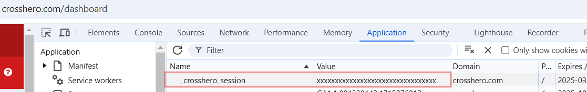
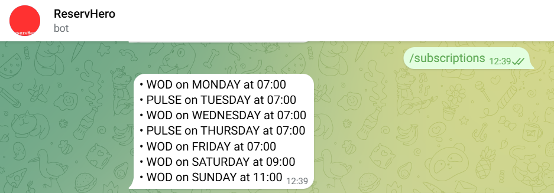

# Reserv Crosshero

A small Telegram bot application to automatically reserve slots in your ([Crosshero](https://crosshero.com/)) CrossFit gym.

## Installation

1. Compile the application into a JAR file as described into the ``Dockerfile``.
2. Run the ``Dockerfile`` with the following environment variables configured:
    ```bash
    BOT_TOKEN             # Telegram bot token
    JDBC_DATABASE_URL     # spring.datasource.url (Postgresql database)
    DB_USERNAME           # spring.datasource.username
    DB_PASSWORD           # spring.datasource.password
    ```

## Usage

1. **Start the bot**: Send the `/start` command to the bot to initialize the interaction.
2. **Check status**: Use the `/status` command to check your current status, including your Telegram ID, active status, and session cookie.
3. **Set session cookie**: Send the `/cookie <session_cookie>` command to set your session cookie. **⚠️WARNING**: _the session cookie is a sensitive piece of information that allows the bot to interact with the Crosshero website on your behalf._
   - Go to a browser and log in to your [Crosshero](https://crosshero.com/) account.
   - Open the developer tools (F12) and go to the "Application" tab.
   - Copy the value of the `_crosshero_session` cookie from the Crosshero website. 
   - Send the cookie to the Telegram Bot with the command `/cookie xxxxxxxxxxxxxxxxxxx`. 
4. **Subscribe to a workout**: Use the `/sub <workout_name> <day_of_week> <hour>` command to subscribe to a workout. For example, `/sub WOD mon 9` to subscribe to the workout of the day on Monday at 9 AM. 
5. **Unsubscribe from a workout**: Send the `/unsub <workout_name> <day_of_week> <hour>` command to unsubscribe from a specific workout. 
6. **Unsubscribe from all workouts**: Use the `/unsuball` command to unsubscribe from all workouts.
7. **List subscriptions**: Send the `/subscriptions` command to list all your current subscriptions. 

## Limitations
- Only works for Crosshero gyms, with applications set up in Spanish.
- For each bot instance, only one gym can be used.
- Error handling is not implemented, so if the bot fails to reserve a slot, it will currently not try again.
- Instance [@ReservHeroBot](https://t.me/ReservHeroBot) is currently limited to [Alcuadrado Box](https://www.alcuadradovalladolid.com/) and 10 users.